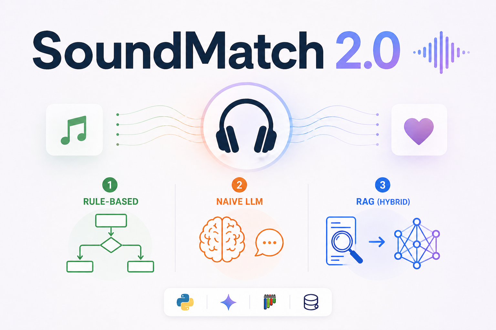
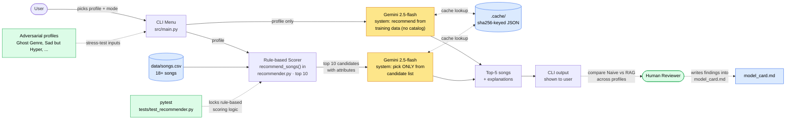

# SoundMatch 2.0 — AI-Augmented Music Recommender

A music recommender that compares a deterministic rule-based scorer against two LLM-driven approaches: a naive LLM call and a retrieval-augmented (RAG) call, over a small catalog. The goal is to make the differences between these approaches concrete and visible: where each one wins, where each one fails, and how grounding an LLM in real catalog data changes its behavior.

This project matters because most public discussion of "AI recommenders" treats the LLM as a black box. SoundMatch 2.0 puts a transparent rule-based system, a naively prompted LLM, and a properly retrieval-augmented LLM side by side on the same inputs, so the trade-offs can be inspected rather than asserted.

## Demo Walkthrough

[](https://www.loom.com/share/0887ccf6e6614092b4b8e7fda65f3181)

▶ [Watch the demo on Loom](https://www.loom.com/share/0887ccf6e6614092b4b8e7fda65f3181) — end-to-end run, AI mode comparison (Naive vs RAG), and the grounding evaluation.

---

## Original Project: SoundMatch 1.0 (Modules 1-3)

The starting point for this project was **SoundMatch 1.0**, a content-based music recommender that represented songs and a user's "taste profile" as structured data and scored each song on a weighted formula — Genre 40%, Mood 30%, Energy closeness 15%, Danceability 10%, Acousticness 5% — to return the top 5 picks with a bullet-list of reasons. It was deliberately rule-based so the scoring logic could be inspected and explained, but the model card surfaced its central weakness: 70% of the score came from binary string-match on genre and mood, so any user whose preferred genre wasn't in the catalog (the "Ghost Genre" adversarial test) silently fell through to weak results.

---

## What's New in 2.0

| | SoundMatch 1.0 | SoundMatch 2.0 |
|---|---|---|
| Recommender output | Rule-based scorer | Gemini 2.5-flash (Naive LLM **or** RAG) |
| Catalog | Read-only `songs.csv` | User can add songs through the CLI |
| User profiles | 8 hardcoded | 8 built-ins + user-created (persisted) |
| Explanations | Joined-string list of matched features | LLM-generated, attribute-grounded sentences |
| Failure on unknown genre ("k-pop") | Silent fallback to weak matches | RAG: explicitly says "k-pop is not in the catalog" and picks closest match |
| Tests | None implemented (stubs only) | 2 pytest tests pinning the rule-based scorer + 9 grounding tests on the AI modes (8 parametrized over profiles + 1 count check) + a runnable `src.evaluate` reliability report |

The rule-based scorer **was not deleted**. It now serves as the **retriever** inside RAG mode — the same scoring logic that used to be the user-facing answer is now the candidate-selection step under the LLM. This makes the comparison between modes honest: same retriever, different reasoners.

---

## Architecture Overview



**Three layers:**

1. **Data layer (blue)** — the song catalog (`data/songs.csv`), a disk cache for LLM responses (`.cache/`), and the human-written model card.
2. **Agent layer (yellow)** — two distinct Gemini calls. **Naive LLM** receives only the user profile and recommends from its training data (no catalog access). **RAG** receives the user profile *plus* the top 10 catalog candidates with full attributes, and is constrained by its system prompt to pick only from that candidate list and to cite concrete attributes in every explanation.
3. **Evaluation layer (green)** — pytest pins the rule-based scoring logic so the RAG retriever can't silently regress; eight adversarial profiles (Ghost Genre, Sad but Hyper, Zero Energy Rocker, Wants Everything, etc.) feed deliberately weird inputs to expose where each mode fails; a human reviewer compares the Naive and RAG outputs and writes findings into `model_card.md`.

LLM responses are cached on disk by `sha256(model + system_prompt + user_prompt)`, so repeat runs of the same input are free, deterministic, and survive across sessions. This is what makes the side-by-side comparisons reproducible.

---

## Setup

**Requirements:** Python 3.10+, a Google Gemini API key (free tier is fine), and a terminal.

```bash
# 1. Clone and enter the repo
git clone <your-fork-url>
cd applied-ai-system-final

# 2. Create a virtual environment
python -m venv .venv
.venv\Scripts\activate         # Windows
# source .venv/bin/activate    # macOS / Linux

# 3. Install dependencies
pip install -r requirements.txt

# 4. Add your Gemini API key
cp .env.example .env
# then edit .env and paste your key from https://aistudio.google.com/app/apikey

# 5. Run the app
python -m src.main
```

The top-level menu lets you:
- **Get recommendations** — pick a user profile (built-in or one you've created), then a mode (Naive LLM or RAG).
- **Add a song to the catalog** — fill in attributes (title, artist, genre, mood, energy, tempo, valence, danceability, acousticness). The new song is appended to `data/songs.csv` and is available immediately.
- **Create a new user profile** — name your profile and fill in genre, mood, target energy, and acoustic preference. Saved to `data/user_profiles.json` and merged into the picker on every future run.

**Other useful invocations:**

```bash
python -m src.main --all                            # Sweep every built-in profile through every mode
python -m src.main --data path/to/custom_songs.csv  # Use a different catalog
python -m src.evaluate                              # Run the grounding evaluation (LLM calls + summary report)
pytest                                              # Run the full test suite (rule-based + grounding)
```

---

## Sample Interactions

The three examples below all use the catalog as shipped in `data/songs.csv`. Outputs are direct transcripts (lightly trimmed for length).

### Example 1: Standard profile, RAG mode (the well-behaved case)

**Input:** profile `High-Energy Pop` (genre=pop, mood=happy, energy=0.9, likes_acoustic=False), mode `RAG`.

**Output (top 3 of 5):**
```
#1  Sunrise City — Neon Echo                                 Score: 98
    This song is an excellent match for your profile. It's squarely in
    the 'pop' genre, features a 'happy' mood, and its energy of 0.82 is
    very close to your target of 0.9. Additionally, its low acousticness
    (0.18) aligns with your preference against acoustic sounds.

#2  Gym Hero — Max Pulse                                     Score: 90
    While the mood is 'intense' rather than 'happy', this song is still a
    strong fit due to its 'pop' genre and very high energy (0.93), which
    is almost exactly your target of 0.9.

#3  Rooftop Lights — Indigo Parade                           Score: 85
    A great choice because it has a 'happy' mood. While its genre is
    'indie pop' rather than pure 'pop', it's a close match.
```

**What it shows:** every pick is a real song in the catalog, every explanation cites concrete attribute values (energy 0.82, acousticness 0.18, genre 'indie pop'), and the LLM acknowledges trade-offs ("the mood is 'intense' rather than 'happy'") instead of pretending every pick is perfect. This is the behavior the RAG system prompt was designed to produce.

### Example 2: Adversarial profile, Naive LLM mode (the hallucination case)

**Input:** profile `Ghost Genre (Nonexistent)` (genre=k-pop, mood=happy, energy=0.7, likes_acoustic=False), mode `Naive LLM`.

**Output:**
```
#1  Red Flavor — Red Velvet                                  Score: 93
#2  Dynamite — BTS                                           Score: 90
#3  DALLA DALLA — ITZY                                       Score: 88
#4  Aju Nice (Very Nice) — SEVENTEEN                         Score: 85
```

**What it shows:** Gemini happily returns four real K-pop songs from its training data. They are *plausible* recommendations for a real human, but **none of them exist in our 19-song catalog**. If this output were piped into a downstream "play this song" feature, every pick would 404. This is the textbook hallucination failure mode that motivates RAG.

### Example 3: Adversarial profile, RAG mode (the headline result)

**Input:** same `Ghost Genre` profile (genre=k-pop), mode `RAG`.

**Output (top 3 of 5):**
```
#1  Sunrise City — Neon Echo                                 Score: 95
    While 'k-pop' is not available in the catalog, 'Sunrise City' is an
    excellent match due to its 'pop' genre, which is a close stylistic
    relative. It perfectly aligns with your 'happy' mood and has a high
    energy of 0.82, very close to your target of 0.7.

#2  Rooftop Lights — Indigo Parade                           Score: 90
    This song, though 'indie pop' instead of k-pop, is a strong contender
    because it matches your 'happy' mood and has an energy level of 0.76,
    which is very close to your target of 0.7.

#3  Electric Dreams — SynthWave Peak                         Score: 85
    Although 'k-pop' is not available, 'Electric Dreams' from the
    'electronic' genre offers a high-energy experience (0.88).
```

**What it shows:** every recommended title exists in the catalog, and the LLM honestly states up front that "k-pop is not available in the catalog" before justifying each substitute. This is the RAG advantage made explicit. The original rule-based scorer in SoundMatch 1.0 *also* returned only catalog songs in this case, but it gave no signal that anything was wrong — it silently weighted on mood and energy and reported scores like 56 with no explanation of why.

---

## Design Decisions

**Why keep the rule-based scorer instead of replacing it.** The cleanest move would have been to delete `recommend_songs` and let Gemini do everything. Instead it now serves as the retriever inside RAG mode. Two reasons: (1) on a 18-song catalog, sending the entire catalog to the LLM every call would work, but on a realistic catalog (millions of tracks) it wouldn't — the retrieval step is the part that actually scales. Building it on day one, even with a fake-tiny catalog, made the architecture honest. (2) Reusing the rule-based scorer means the `pytest` tests on it directly protect the RAG retriever; if someone later "improves" the scoring weights and breaks the retrieval, the tests catch it.

**Why Gemini and not Claude or GPT-4.** Gemini 2.5-flash has a generous free tier, native JSON-mode output (`response_mime_type="application/json"`), and a configurable thinking budget that can be set to 0 to keep response latency and token cost predictable. The wrapper in `src/llm_client.py` is intentionally thin so swapping providers would be straightforward; the Gemini-specific bits are isolated to the `client.models.generate_content` call.

**Why disk-cache LLM responses by prompt hash.** Two motivations: (1) developing an LLM-driven feature requires running the same prompt many times, and burning quota on identical inputs is wasteful. (2) A class project benefits enormously from deterministic output for screenshots and the writeup — caching by `sha256(model + system + prompt)` means the same input always produces the same output across sessions, even though the underlying model is non-deterministic.

**Why a CLI menu instead of a web UI.** Streamlit is in `requirements.txt` from the original project but unused. The CLI keeps friction low for graders and reviewers — no port management, no browser state, just `python -m src.main`. The menu structure (top-level → sub-flow) is verbose to type but reads cleanly in screenshots, which matters for the model card.

**Why persist user-created songs and profiles to disk.** The natural alternative was session-only storage. Persistence (`data/songs.csv` for songs, `data/user_profiles.json` for profiles) is more useful in practice — a user who creates a profile once shouldn't have to recreate it on every run — and the implementation cost was small (one new file, two helper functions, an extra `--profiles` flag).

**The trade-off I'd flag.** Naive LLM mode is *strictly worse* than RAG mode for this task. I kept it because the comparison is what the project is *about* — without Naive mode, there's no concrete demonstration of why RAG matters. But in a production system, I'd never ship Naive mode as a user-facing option; it would only ever exist as an evaluation harness.

---

## Testing Summary

The system's reliability is measured three ways: **automated unit tests** on the rule-based core, an **automated grounding evaluation** that quantifies how often each AI mode stays inside the catalog, and a **human review pass** documented in `model_card.md`.

**Headline measurement (from `python -m src.evaluate`, 8 profiles × 2 modes = 16 LLM calls):**

| Mode | Successful calls | Items returned | Titles in catalog | Grounding rate |
|---|---|---|---|---|
| Naive LLM | 4/8 | 20 | 0 | **0%** |
| RAG | 3/8 | 15 | 15 | **100%** |

Of the LLM calls that completed, RAG produced **zero hallucinations** across every profile, and Naive LLM produced **zero in-catalog titles** — every Naive recommendation was a real-world song that doesn't exist in `data/songs.csv` (e.g., "Reflection" by Toonorth, "Morning Coffee" by L.Dre, "Dynamite" by BTS). Same model, same profile, different prompt structure → opposite reliability outcomes. This is the cleanest demonstration of why the retrieval-augmented design matters.

**Automated test suite (`pytest`):** 11 tests total, **8 passed and 3 skipped** in the latest run. The 2 rule-based tests and the grounding tests on profiles whose LLM call succeeded all pass — including the headline assertion that every RAG-returned title is in the catalog. The 3 skipped tests are profiles whose LLM call hit Gemini's free-tier daily quota and could not break through even after retries; they skip rather than fail because the contract under test is the LLM's adherence to its system prompt, not Gemini's free-tier uptime. As the disk cache fills in across runs, the skip count drops.

**Reliability finding from the eval.** Under sustained load, free-tier Gemini returns 429 RESOURCE_EXHAUSTED when the per-minute cap (~10 RPM on `gemini-2.5-flash`) is exceeded. After observing this in early eval runs, I added bounded exponential backoff (2s → 4s → 8s, max 3 retries) on 429 / 503 errors in `src/llm_client.py`. Per-minute hits now retry silently and most succeed, then write to `.cache/` permanently — subsequent runs hit the cache and pay no API cost. The daily quota (~250 RPD) is a hard ceiling that retries cannot defeat: calls hitting it surface as `LLMError` rather than silently producing bad output, which is the correct failure mode but does require waiting for the UTC quota reset.

**What I learned from the measurements.** Three things stood out. (1) The *system prompt* in RAG mode is doing most of the work — without "you MUST pick songs ONLY from the candidate list", Gemini freely mixes catalog songs with hallucinated ones. The constraint has to be in the prompt, not just in the calling code. (2) Naive LLM's 0% grounding rate is striking: even when given a profile that exactly matches a catalog song's attributes (e.g., "lofi" + "chill" — Midnight Coding fits perfectly), Gemini reaches for famous training-data tracks like "Snow & Chill" by Purrple Cat instead. Without retrieval, the LLM doesn't know the catalog exists. (3) Setting up the eval revealed two real bugs the manual smoke tests had missed: the deprecated `google-generativeai` SDK silently failed against `gemini-1.5-flash` (model retired), and `gemini-2.5-flash`'s default non-zero thinking budget silently truncated longer JSON responses. Both surfaced as parse failures, not obvious errors — a reminder that LLM-facing code needs defensive validation. Fixed by migrating to `google-genai` and setting `thinking_config=ThinkingConfig(thinking_budget=0)` + `max_output_tokens=4096`.

---

## Reflection

The biggest realization is that using AI was an architectural choice that had consequences throughout the building process. The interesting question for this project wasn't "should I add an LLM?" but "where should the LLM sit in the pipeline?" Putting it at the *output* (Naive LLM) makes the system more articulate but unmoored from the data. Putting it at the *output, with a retriever in front* (RAG) makes it both articulate and grounded, but requires building and maintaining a retriever, which is essentially the same problem the rule-based system was already solving. The rule-based scorer didn't go away, it changed its role.

The other thing I learned is how much the model card matters once an LLM is in the picture. With a deterministic rule-based system, you can audit it by reading the code. With an LLM, the only way to know how it actually behaves is to run it on a deliberate set of adversarial inputs and write down what you saw. It's something you'd want to repeat every time the model version changes (and in this project, that already happened once when 1.5-flash was retired).

If I had more time, the next steps would be: (1) replace the binary genre/mood matching in the retriever with a similarity score so "rock" can return "metal" candidates and the filter-bubble problem the original SoundMatch 1.0 model card identified is actually fixed; (2) add an evaluator agent that automatically diff's Naive vs RAG output across all profiles and flags hallucinations (titles not in the catalog) without a human in the loop; (3) wire in the Streamlit UI that's already in `requirements.txt` so the side-by-side comparison can be screenshotted in one frame instead of two.

---

## Project Layout

```
applied-ai-system-final/
├── src/
│   ├── main.py            # CLI menu + flow dispatch
│   ├── recommender.py     # Rule-based scorer (now RAG retriever) + AI mode functions + persistence helpers
│   ├── llm_client.py      # Thin Gemini wrapper with disk-cached generate_json()
│   └── evaluate.py        # Reliability eval: grounding rate across all profiles × modes
├── data/
│   ├── songs.csv          # Catalog (19 shipped songs + any you add)
│   └── user_profiles.json # Profiles you create at runtime (created on first save)
├── tests/
│   ├── test_recommender.py  # Unit tests on the rule-based scorer
│   └── test_grounding.py    # Live-LLM tests asserting RAG never hallucinates a title
├── assets/
│   └── music_recommender_flowchart.mmd  # Mermaid source for the architecture diagram
├── .cache/                # LLM response cache (gitignored)
├── .env                   # API key (gitignored — copy from .env.example)
├── model_card.md          # Bias, limitations, and adversarial findings
├── requirements.txt
└── README.md
```
